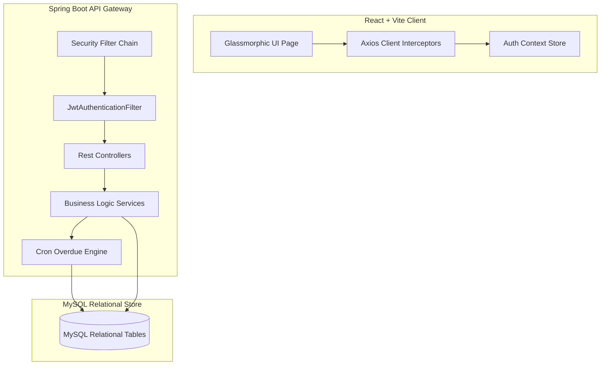

# Lumina Library Portal

> A premium full-stack library management system featuring Spring Boot stateless JWT security, automatic double-token rotation, an automated overdue transaction engine, and a high-fidelity glassmorphic React interface.

---

## Table of Contents

- [Prerequisites](#prerequisites)
- [Architecture & Design Decisions](#architecture--design-decisions)
- [Database Schema Design](#database-schema-design)
- [Installation](#installation)
- [Usage](#usage)
- [Configuration](#configuration)
- [API Contracts](#api-contracts)
- [Contributing](#contributing)
- [License](#license)

---

## Prerequisites

To run this application locally, you must have the following runtime environments and dependencies installed:

*   **Java Development Kit (JDK)**: `>= 17.x` (Fully compiled and tested on JDK `25.0.2` LTS)
*   **Node.js**: `>= 18.x` (Tested on Node `v24.15.0`)
*   **Package Managers**: `npm >= 10.x` and Maven Wrapper `mvnw` (included in repository)
*   **Database Server**: **MySQL Server** `>= 8.0`

---

## Architecture & Design Decisions

Lumina Library Portal is built on a decoupled, stateless client-server architecture. The Spring Boot backend acts as a strict API gateway, while the Vite + React client manages application state, views, and routing guards.



> **Design Note:** The database models decouple user accounts from active authentication tokens. We maintain a discrete `refresh_tokens` entity rather than storing tokens as text attributes in the `users` table to support multi-device sessions, enforce independent token lifetimes, and permit granular session revocation.

> **Design Note:** The JWT authentication filter (`JwtAuthenticationFilter`) runs exactly once per request. It checks for a valid Bearer token, extracts security contexts, and populates the `SecurityContextHolder`. We keep the security interceptor stateless, pushing the token refresh state entirely to a distinct REST endpoint (`/api/auth/refresh`) that matches client-side automatic Axios interceptor rotations.

> **Design Note:** To prevent concurrency issues (such as two students borrowing the same last copy of a book at the same instant), we leverage transactional JPA updates with verification. The `BorrowingService` checks active copy counts, locks down operations, and performs inventory updates atomically, guaranteeing consistency in high-throughput environments.

---

## Database Schema Design

The relational database is optimized for quick indexing, referencing, and automatic updates. The engine automatically seeds structural schemas on boot using hibernate mapping rules.

### Database Tables

| Table Name | Primary Key | Attributes & Constraints | Foreign Keys |
| :--- | :--- | :--- | :--- |
| `users` | `id` (BIGINT) | `email` (VARCHAR, Unique), `password_hash` (VARCHAR), `role` (ENUM: `ADMIN`, `STUDENT`), `created_at` (TIMESTAMP) | None |
| `books` | `id` (BIGINT) | `title` (VARCHAR), `author` (VARCHAR), `isbn` (VARCHAR, Unique), `genre` (VARCHAR), `total_copies` (INT), `available_copies` (INT), `created_at` (TIMESTAMP) | None |
| `borrowing_transactions` | `id` (BIGINT) | `checkout_date` (TIMESTAMP), `due_date` (TIMESTAMP), `return_date` (TIMESTAMP, Nullable), `status` (ENUM: `ACTIVE`, `RETURNED`, `OVERDUE`) | `user_id` -> `users.id`<br>`book_id` -> `books.id` |
| `refresh_tokens` | `id` (BIGINT) | `token` (VARCHAR, Unique), `expires_at` (TIMESTAMP) | `user_id` -> `users.id` |

---

## Installation

Follow these instructions to clone, configure, and install both application components.

### 1. Database Setup

Ensure your MySQL Server is running. Create a schema called `library_management_system`:
```sql
CREATE DATABASE library_management_system;
```

### 2. Backend Installation & Verification
Configure your database properties inside `./src/main/resources/application.properties` (see [Configuration](#configuration)). Then compile the backend to verify the integrity of all source files:
```powershell
# Clean and compile Java bytecode
.\mvnw.cmd clean compile
```

### 3. Frontend Installation & Build
Install node modules and verify that Vite compiles the production package correctly:
```bash
# Navigate to the React app directory
cd frontend

# Install package dependencies
npm install

# Compile the production bundle
npm run build
```

---

## Usage

To start both servers locally for development and testing, run these commands in separate terminal sessions.

### Step 1: Boot the Spring Boot REST Server
From the project root workspace directory:
```powershell
# Run local boot loader
.\mvnw.cmd spring-boot:run
```
On boot, the backend automatically seeds the database with the default admin and student accounts, along with five premium books.

### Step 2: Boot the React Vite Dev Server
From the `./frontend` directory:
```bash
# Spin up dev server
npm run dev
```
Open your browser and navigate to `http://localhost:5173`.

### Seeded Credentials

| Email Address | Password | Role | Features Accessible |
| :--- | :--- | :--- | :--- |
| `admin@library.com` | `admin123` | **Librarian (ADMIN)** | Full Catalog CRUD Management Modals & Global Borrowing Logs |
| `student@library.com` | `student123` | **Student (STUDENT)** | Catalog Book Borrowing & Personal Borrow Progress Bars / Returns |

---

## Configuration

### Backend: `application.properties`
The backend leverages standard environment profiles to inject configuration values securely. Below are the key configuration variables:

| Parameter Key | Purpose | Recommended Value |
| :--- | :--- | :--- |
| `spring.datasource.url` | MySQL JDBC Connection Endpoint | `jdbc:mysql://localhost:3306/library_management_system` |
| `spring.datasource.username` | MySQL Username | `root` |
| `spring.datasource.password` | MySQL Password | `root` |
| `app.jwt.secret` | HS512 Encryption Secret Key | *64-character hex security string* |
| `app.jwt.accessTokenExpirationMs` | Access Token Lifetime | `900000` *(15 minutes)* |
| `app.jwt.refreshTokenExpirationMs` | Refresh Token Lifetime | `604800000` *(7 days)* |

---

## API Contracts

All API requests must carry `Content-Type: application/json`. Protected endpoints require an `Authorization: Bearer <access_token>` header.

### Authentication Endpoints
*   `POST /api/auth/register` — Register a new account (`email`, `password`, `role`).
*   `POST /api/auth/login` — Login (`email`, `password`). Returns access token, refresh token, role, and expiration parameters.
*   `POST /api/auth/refresh` — Rotate an expired access token (`refreshToken`). Returns new access token and refresh token details.
*   `POST /api/auth/logout` — Revoke and clean up active session refresh tokens (`refreshToken`).

### Book Catalog Endpoints
*   `GET /api/books` — Retrieve catalog books (*Permitted: STUDENT, ADMIN*).
*   `GET /api/books/search?q=<query>` — Keyword matching search across title, author, genre, or ISBN (*Permitted: STUDENT, ADMIN*).
*   `POST /api/books` — Add a new book title to inventory (*Permitted: ADMIN*).
*   `PUT /api/books/{id}` — Edit an existing book's details and total copies (*Permitted: ADMIN*).
*   `DELETE /api/books/{id}` — Remove a book title (*Permitted: ADMIN*).

### Transaction Endpoints
*   `POST /api/books/borrow` — Checkout an active copy of a book (`bookId`) (*Permitted: STUDENT*).
*   `POST /api/books/return` — Check-in a checked-out book (`transactionId`) (*Permitted: STUDENT*).
*   `GET /api/transactions/my` — Get personal borrowing logs (*Permitted: STUDENT*).
*   `GET /api/transactions` — Get all historical and active library checkouts (*Permitted: ADMIN*).

---

## Contributing

We use standard git branching strategies to maintain code hygiene:

1.  **Fork** this repository.
2.  Create your development feature branch: `git checkout -b feat/your-feature-name`.
3.  Commit your modifications using standard conventional commit formats.
4.  Push changes to your branch and open a **Pull Request**.

---

## License

Distributed under the **MIT License**. See `LICENSE` for more information.
