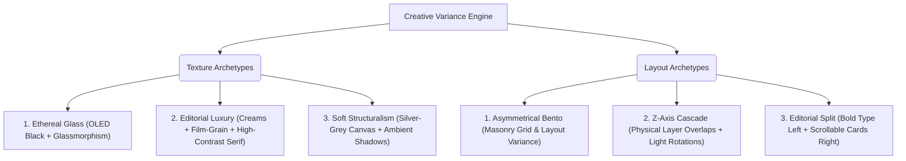

# 🏛️ The Antigravity UI/UX Masterclass: Designing at $150k+ Agency Standards

Welcome to the **Lumina Library Engineering Guide to High-End Interface Design**. This document provides an exhaustive, practical handbook on how to invoke and apply our specialized frontend design directives—specifically **`@/soft-skill` (High-End Visual Design)** and **`@/minimalist-skill` (Premium Utilitarian Minimalism)**—to elevate ordinary functional interfaces into high-end, tactile, and highly emotional user experiences.

---

## 💎 SECTION 1: Understanding specialized "Skills"

In the Antigravity developer environment, **Skills** represent encapsulated repositories of professional-tier knowledge, design systems, architectural guardrails, and behavioral guidelines. They instruct our agentic AI to override default LLM biases (such as generic cards-inside-cards layouts, standard Inter typography, and default gray borders) in favor of elite, design patterns.

You can explicitly trigger these skills in your prompts by referencing them with special syntax:
* **`@/soft-skill`** (aliases: `high-end-visual-design`, `@/soft-skill`)
* **`@/minimalist-skill`** (aliases: `minimalist-ui`, `@/minimalist-skill`)

---

## 🎨 SECTION 2: Masterclass on `@/soft-skill` (High-End Visual Design)

The primary objective of the **High-End Visual Design** skill is to engineer Awwwards-tier digital experiences that exude **haptic depth, tactile spatial rhythm, and kinetic motion**. It is heavily inspired by modern design houses like Apple, Linear, and Vercel.

### 🚫 The "Absolute Zero" Banned Elements (Anti-Patterns)
If any of these defaults slip into your codebase, the high-end illusion instantly breaks:
* **Banned Fonts:** `Inter`, `Roboto`, `Arial`, `Open Sans`, `Helvetica` (always use premium, geometric, or editorial serifs).
* **Banned Icons:** Thick-stroked standard Lucide or Material Icons. (Instead, use ultra-light, precise 1px/1.5px vector strokes).
* **Banned Borders/Shadows:** Default 1px solid gray borders (`border-stone-200`) or harsh, dark shadows (`shadow-md`).
* **Banned Layouts:** Edge-to-edge sticky navbars glued to the screen top; generic, symmetrical grid columns without macro-whitespace.
* **Banned Motion:** Default `linear` or `ease-in-out` transitions.

---

### 🏛️ The Core Architectural Archetypes

Before writing a single line of CSS or React, `@/soft-skill` evaluates the semantic context and rolls its **Creative Variance Engine** to adopt a specific visual personality:



---

### 🛠️ Key Signature Components & Implementing Code

#### A. The "Double-Bezel" (Doppelrand Container)
Never place cards or containers flatly on a background. They must look like physical, machined hardware panels nested elegantly into a tray.

```jsx
// Premium Doppelrand (Double-Bezel) Card Architecture
const PremiumCard = ({ children }) => {
  return (
    /* Outer Shell: Provides outer margin/padding, structural radius, and deep ambient shadow */
    <div className="bg-stone-900/5 dark:bg-white/5 p-2 rounded-[2rem] ring-1 ring-black/5 dark:ring-white/10 shadow-xl transition-all duration-700 ease-[cubic-bezier(0.32,0.72,0,1)]">
      
      {/* Inner Core: Hosts the actual content, custom top-bezel highlight, and mathematical squircle curve alignment */}
      <div className="bg-white dark:bg-stone-950 p-8 rounded-[calc(2rem-0.5rem)] shadow-[inset_0_1px_1px_rgba(255,255,255,0.15)] border border-stone-200/40 dark:border-stone-800">
        {children}
      </div>
    </div>
  );
};
```

#### B. The "Button-in-Button" trailing icon
Primary CTA buttons should have an isolated, highly interactive circular background enclosing their trailing action vector.

```jsx
// Button-in-Button CTA Pill
const CTAButton = ({ text }) => {
  return (
    <button className="group px-6 py-3 bg-stone-950 text-stone-100 hover:text-white text-xs font-bold rounded-full transition-all duration-500 ease-[cubic-bezier(0.32,0.72,0,1)] flex items-center gap-4 hover:bg-stone-900 active:scale-[0.98]">
      <span>{text}</span>
      <span className="w-8 h-8 rounded-full bg-white/10 flex items-center justify-center transition-transform duration-500 group-hover:translate-x-1 group-hover:-translate-y-[1px] group-hover:scale-105">
        <svg className="w-3.5 h-3.5 stroke-[1.5]" fill="none" viewBox="0 0 24 24" stroke="currentColor">
          <path strokeLinecap="round" strokeLinejoin="round" d="M4.5 19.5l15-15m0 0H8.25m11.25 0v11.25" />
        </svg>
      </span>
    </button>
  );
};
```

---

## ☕ SECTION 3: Masterclass on `@/minimalist-skill` (Premium Utilitarian Minimalism)

Where `@/soft-skill` brings cinematic layers and spring-loaded transitions, **`@/minimalist-skill`** introduces the clean, silent, highly disciplined **editorial-style layout** resembling physical print books and professional workspace document design.

### 🚫 Banned Elements (Anti-Patterns)
* NO gradients, neon glows, or translucent glassy overlays.
* NO `rounded-full` (pill shapes) for large cards, tables, or content wrappers.
* NO generic SaaS marketing words ("game-changing", "elevate", "seamless").
* NO heavy drop shadows. Shadows must be completely flat.

### 🎨 The Muted Pastel Palette
In minimalism, color is treated as a scarce resource, utilized only for semantic status badges or very minor text highlights.

| Accent Name | Background HEX | Text HEX | Semantic Usage |
| :--- | :--- | :--- | :--- |
| **Pale Red** | `#FDEBEC` | `#9F2F2D` | Alerts, critical states, overdue returns |
| **Pale Blue** | `#E1F3FE` | `#1F6C9F` | Informational chips, metadata markers |
| **Pale Green** | `#EDF3EC` | `#346538` | Success labels, returned books |
| **Pale Yellow** | `#FBF3DB` | `#956400` | Warning tags, pending transactions |

---

### 🛠️ Key Signature Components & Implementing Code

#### A. Flat Bento Cards & Dividers
Grid boxes use highly disciplined `1px solid #EAEAEA` lines, clean body heights, and ultra-crisp radii (`8px` to `12px`).

```jsx
// Bento Card Architecture in Premium Minimalism
const BentoCard = ({ title, category, children }) => {
  return (
    <div className="bg-[#FFFFFF] border border-stone-200 rounded-xl p-8 transition-shadow duration-300 hover:shadow-[0_4px_16px_rgba(0,0,0,0.03)] flex flex-col gap-6">
      <div className="flex items-center justify-between">
        <span className="text-[10px] uppercase font-bold tracking-widest text-stone-400">{category}</span>
        <span className="px-2.5 py-1 text-[9px] font-bold rounded bg-[#EDF3EC] text-[#346538] uppercase tracking-wider">
          Active
        </span>
      </div>
      <h3 className="font-serif font-bold text-xl text-stone-900 tracking-tight">{title}</h3>
      <div className="text-stone-600 text-sm leading-relaxed font-sans">{children}</div>
    </div>
  );
};
```

#### B. Keystroke Micro-UIs (`<kbd>`)
To indicate keyboard interaction shortcuts elegantly, use physical `<kbd>` rendering with monospace typefaces.

```jsx
// Minimalist Search Bar with Keyboard Shortcuts
const SearchBar = () => {
  return (
    <div className="relative flex items-center border border-stone-200 rounded-lg bg-stone-50/50 px-4 py-3 w-full max-w-md">
      <input 
        type="text" 
        placeholder="Search books..." 
        className="bg-transparent border-none text-xs text-stone-900 focus:outline-none w-full font-sans" 
      />
      <div className="flex items-center gap-1">
        <kbd className="px-2 py-0.5 border border-stone-200 bg-white rounded text-[9px] font-mono text-stone-400">⌘</kbd>
        <kbd className="px-2 py-0.5 border border-stone-200 bg-white rounded text-[9px] font-mono text-stone-400">K</kbd>
      </div>
    </div>
  );
};
```

---

## ⚡ SECTION 4: How to Invoke and Configure Skills Perfectly

To trigger these systems during collaborative engineering turns, combine the **name of the skill**, a specified **visual density**, and your **layout context**.

### 🌟 Elite Prompting Formulas

#### Example 1: Refactoring with High Visual Density & Soft Design
> `"Refactor the library's User Profile page using @/soft-skill with a VISUAL_DENSITY of 3"`
* **What this outputs:** An extremely elegant, spacious, double-bezel enclosed user dashboard. Layout columns use macro-whitespace (`py-24`), buttons morph with diagonal translation vector icons, and card containers have exaggerated radii (`rounded-[2rem]`) and radial glass glows.

#### Example 2: Flat Bento Editorial Layout
> `"Apply @/minimalist-skill to our dashboard components"`
* **What this outputs:** Flat bento layouts utilizing `#FBFBFA` bone canvas, high typographic contrast using serif headings against geometric system monospaces, ultra-crisp borders (`border-stone-200`), and semantic tags colored in washed-out pastels.

#### Example 3: The Hybrid Premium Layout
> `"Refactor this transaction feed using @/soft-skill for spring-based motions but keep the aesthetics strictly styled under @/minimalist-skill"`
* **What this outputs:** Flat, minimalist white cards with `#EAEAEA` borders and bone canvas. However, on hover, they execute spring-loaded `cubic-bezier(0.32, 0.72, 0, 1)` transitions, lifting gently with highly diffused ambient drop shadows and kinetic vector micro-movements.

---

### 📈 System Contrast Matrix: Which Skill to Choose?

| Metric | `@/soft-skill` | `@/minimalist-skill` |
| :--- | :--- | :--- |
| **Aesthetic Personality** | Ethereal Glass / Luxury Agency | Editorial Workspace / Clean Print |
| **Border Radii** | Exaggerated (`rounded-[2.5rem]`) | Crisp (`rounded-xl` / `8px-12px`) |
| **Motion Signature** | Spring-based haptic acceleration | Silent, invisible ease Reveals |
| **Canvas Palette** | OLED Dark / Rich Creams | `#FFFFFF` White / `#F7F6F3` Bone |
| **Color Highlights** | Radial gradients, neon accents | Muted desaturated spot pastels |
| **Ideal For** | Landing pages, interactive portfolios, SaaS headers | Data tables, administrative feeds, utility settings |

---

*This guide was generated by Antigravity in cooperation with Lumina Library to maintain an elite standard of digital craftsmanship across all codebase assets. Maintain documentation integrity at all times.*
